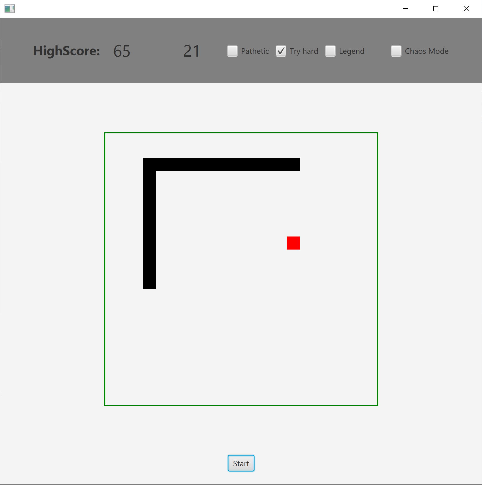

# SnakeJavaFX
The reason for this project was to practice my programming skills I have learned so far after my first year studying computer science.
## Installation
### What you'll need
* Your favorite IDE
* Java SDK 15 has been used
* Install gradle
### Make it run
- Clone repository
- open up a terminal => `gradle run`
## About the game

This project is my oven version of the famous snake game.
The player can chose between 3 different speed levels.
There is also a so called chaos mode which will generate 3 different kind of special effect items.  
<strong>shrink</strong> makes the snake body shrink by a random number in a defined range 
<strong>grow</strong> makes the snake body grow by a random number in a defined range 
<strong>extra points</strong> adds or remove points by a random number in a defined range  
This special effect items are shown as green rectangles.
Regular food items are shown as red rectangles.

### How to play

Press Start to play a game!

Key  | Action
------------- | -------------
W  | move UP
D  | move RIGHT
S  | move DOWN
A  | move LEFT

## About the project

My goal was not to write a fullyfunctional snake game with the least amount of code. My goal was to write code easy to maintain, understand and extend.
I also wanted to make use of concepts I have learned during my first year at studies. Like for example clean code, multi-threading and the mvc pattern.
